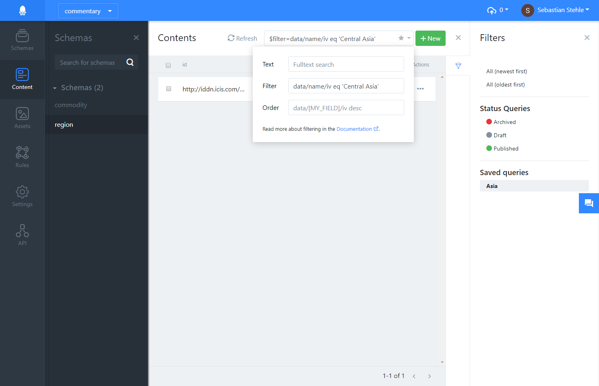
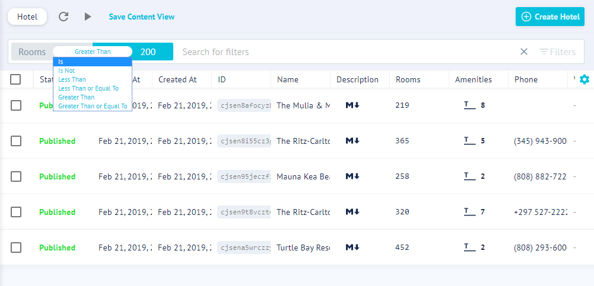
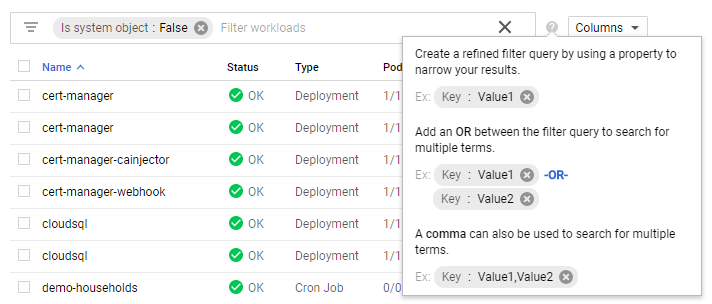
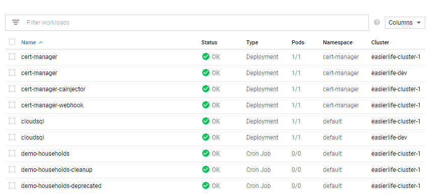

# Queries

## Capabilties

The Squidex query system supports the following capabilities:

* Filters like `WHERE` in SQL
* Pagination parameters (`top` and `skip`)
* Full text search
* Ordering like `ORDER BY` in SQL

The query system is language agnostic but is based on OData for parsing. In theory, other syntaxes can be added to the system to implement better editors for the user interface.

## Schema

The filter capabilities depends on the schema. 

Lets take the following example content:

```json
{ 
    "id": "01",
    "created": "2017-02-25T19:56:35Z",
    "createdBy": "...",
    "lastModified": "2017-02-25T19:56:35Z",
    "lastModifiedBy": "...",
    "data": {
        "name": {
            "de": "München",
            "en": "Munich"
        },
        "clubs": {
            "iv": [
                "e14eceeb-1b2c-425e-883a-dc011adaffd6",
                "5c6f87eb-6470-45e1-a5ca-c87d4f86cbfc"
            ]
        },
        "population": {
            "iv": 1400000
        }
    }
}
```

* **Population** is obviously a number, so you can use queries like 
    * `greater than (>)`
    * `greater equals (>=)`
    * `less than (<)`
    * `less equals (<=)`
    * `equals`
* **Name** is obviously a string, so you can use filters like
    * `contains`
    * `startsWith`
    * `endsWith`
* **Clubs`** is a reference to other contents items, but also stored as a string. Similar to MongoDB arrays of strings are treated like strings, so when use an equality filter you actually filter out all content items, that contain at least one reference to the given id.

## OData Queries

OData is the only syntax so far, but as I said: The implementation is syntax agnostic.

### $top

The `$top` query option restricts the number of delivered content items.

    $top=30

### $skip

The `$skip` query option just skips the first N items.

    $skip=20

or combined with top

    $skip=20&$top=30

### $search

The $search query option allows clients to request entities matching a free-text search expression.

    ?$search=Munich

### $filter

Find the city with the english name Munich

    $filter=data/name/en eq Munich

Find all cities with a population or more than 100000 people

    $filter=data/population/iv gt 100000

## User interface

The user interface has very limited capabilities to create your own queries. It is basically the responsibility to the user to understand the query syntax.

Queries can also be saved as a favorite to the right sidebar:



## Evaluation

### Pro #1: Textual representation

The textual representation is easy to use for developers. You can store your query in an editor or a document like this and you can use it with postman or add it to the URL.

### Con #1: No parameters

Queries can not be parameterized, but it would be very easy to add some special placeholder like `ME` to bulild queries like.

    $filter=lastModifiedBy eq 'Me'

### Con #2: References

Like in SQL you need the id of the referenced content to query by them, there is not easy workaround with the current query system. It would only work if the displayed value in the query UI is not necessarily the uses value.

### Con #3: No user specific favorites

Queries that are saved added for all users, you cannot create your own favorites.

## Future development

The goal is to implement a new query language with a better editor. Some ideas from easy okay to great:

### Approach #1: GraphCMS editor

Very small UI with limitations as you cannot use OR queries and nested queries in general. Also very small text.



### Approach #2: Query builder

There are a few query builders that usually look like this:


-OR-


### Approach #3: Google Cloud Engine

Nice query editor with autocompletion:



As animated GIF

